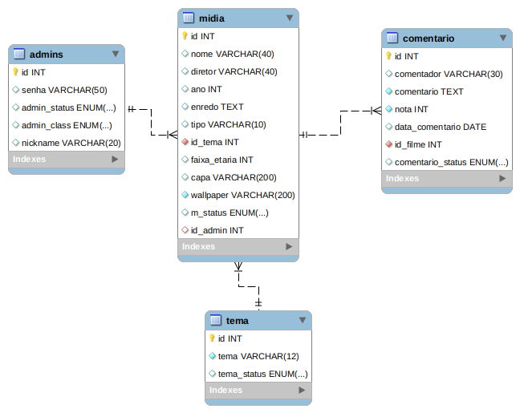

# assisflix

trabalho acadêmico de programação orientada a objetos 2

## sobre a aplicação:

A aplicação é um guia de midia feito com java web, que conecta a um banco de dados mysql.

## funcionalidades:
<ul>
<li>
pesquisar por filmes e séries
</li>
<li>
enviar um comentário e uma nota sobre determinada série ou filme.
</li>
<li>
efetuar login uso de criptografia(MD5)
</li>
<li>
usar painel de controle de comentários, administradores midias e temas;
</li>
<li>
separar administradores com privilégios.
</li>
</ul>

## EER do projeto:

